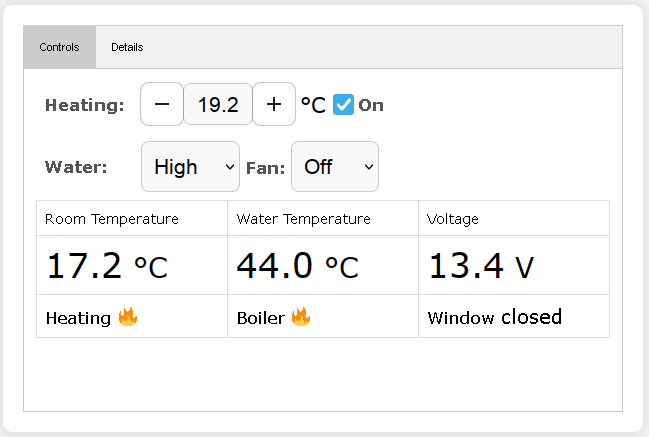

# Cp plus emulator for a truma combi D

This project uses an esp32 to emulate a cp-plus to control a truma combi D (the model with the square cowl).

It connects to an mqtt broker to get the settings for the heating, boiler and fan and to report back the status of the combi.

It also provides a simple web interface to control the combi. The settings can also be given using the serial port.

This software is not provided, endorsed, supported, or sponsored by Truma. It may or may not be working with their products. 
Please read the [license file](LICENSE), in particular:

IN NO EVENT UNLESS REQUIRED BY APPLICABLE LAW OR AGREED TO IN WRITING WILL ANY COPYRIGHT HOLDER,
OR ANY OTHER PARTY WHO MODIFIES AND/OR CONVEYS THE PROGRAM AS PERMITTED ABOVE, BE LIABLE TO YOU FOR DAMAGES,
INCLUDING ANY GENERAL, SPECIAL, INCIDENTAL OR CONSEQUENTIAL DAMAGES ARISING OUT OF THE USE OR INABILITY TO
USE THE PROGRAM.

## build it

To build it you'll need platformio. You should also create a `wifi.h` file with the details of your wifi access point and
of your mqtt broker, please see the comments in `main.cpp`.

Change the settings in `platformio.ini` to suit your board and your preferences.

If you want to use the webserver don't forget to `Build Filesystem Image` and to `Upload Filesystem Image`.

## connection to the combi

To connect to the combi you can follow the "Hardware requirements" section of the [inetbox.py](https://github.com/danielfett/inetbox.py) project 
(of course you don't need a cp-plus and instead of connecting the transceiver to the raspberry pi you'll have to connect it to the esp32).
I used pin 19 for TX (connected to the RX of the transceiver) and pin 18 for RX (connected to the TX of the transceiver) but you can change the pins
with the defines in `main.cpp`.

Also, since this is the master on the lin-bus, if you use the same transceiver you should bridge the `LIN` and `INH` terminals of the transceiver.

## web interface

It's a simple web interface to control the combi

There are two tabs, the Controls tab allows you to control the combi and see the basic operating data, while the Details tab will show a lot of 
details about the operation of the combi.

The settings made from the web interface will be replicated to the mqtt broker, and the settings made from the mqtt broker will be shown on the web interface.

If you don't need it or you find it crashes your esp32 (it works ok on an esp32-c3 but I had some issues on a wroom module) you can omit the
`-DWEBSERVER` define in the platformio.ini file.

## serial interface

Connecting to the serial interface of the esp32 (115200/N/8/1), apart from seeing some status information, you
can also give commands. Just issue the `help` command to get a list of the available commands.
Since you can adjust the setpoints from the serial interface, they will be replicated to the mqtt broker and 
to the web interface.

## mqtt setpoints

The setpoints received from the mqtt broker are under the `truma/set` topic and are:

|topic|value|notes
|--|--|--|
|truma/set/simultemp|from -273.0 to 30.0|used to simulate the room temperature, set it to -273.0 to use the real temperature|
|truma/set/temp|from 0.0 to 30.0|room temperature setpoint, use 0.0 to turn off the heating, 5.0 or more to turn it on|
|truma/set/boiler|off, eco, high or boost|hot water setting|
|truma/set/fan|off, eco, high or from 0 to 10|use 0 to 10 for ventilation (heating must be off), with the heating on 1 and 2 are equivalent to eco/high|
|truma/set/reset|1|use it to request an error reset, be sure to make it not remanent|

## mqtt status

The status information is reported under the `truma/status` topic, each topic is refreshed only when its value has changed, 
a connection to the broker has just been established or 10 seconds have passed from the last update (in the latter two cases
only when the value has been read from the combi).

There are a lot of topics that I won't describe here but you can see them in the "Details" tab of the web interface.
The main topics are:

|topic|value|notes|
|--|--|--|
|truma/status/room_temp|temperature in ºC|the current room temperature (only refreshed if the combi is active)|
|truma/status/water_temp|temperature in ºC|the current water temperature (only refreshed if the combi is active)|
|truma/status/voltage|supply voltage in V|the current supply voltage (only refreshed if the combi is active)|
|truma/status/antifreeze|0 or 1|antifreeze status, 1 ok, 0 not ok|
|truma/status/supply220|0 or 1|I guess it's 1 when there's 220V supply, 0 when there isn't, I don't have a combi E|
|truma/status/window|0 or 1|0 window open, 1 window closed|
|truma/status/roomdemand|0 or 1|1 when the burner is on to heat the room|
|truma/status/waterdemand|0 or 1|1 when the burner is on to heat the water|
|truma/status/error|0 or 1|1 when there is an error condition|
|truma/status/err_class|0,1,2,10,20,30,40|0=no error, 1,2=warning, 10,20,30=error, 40=locked|
|truma/status/err_code|0 to 255|0=no error otherwise an error/warning code|
|truma/status/err_short|0 to ?|the short error code (number of times the error led blinks)|

There are some special topics that don't come from the combi but are generated locally, they are:

|topic|value|notes|
|--|--|--
|truma/status/reset|0 or 1|indicates that an error reset is underway (when the value is 1)|
|truma/status/linok|0 or 1|indicates that the lin bus connection is healthy (1) or faulty (0)|
|truma/status/waterboost|from 0 to 40|indicates the remaining waterboost minutes (or 0 if the waterboost is not active)|

## led

The led is used to show some error conditions blinking with a pause of 500ms between each blinking cycle.
Only one error condition can be shown at a time. 

|number of blinks|meaning|
|--|--|
|steady on|everything ok|
|1|no wifi connection|
|2|no mqtt connection|
|3|lin bus error|
|4|performing error reset|
